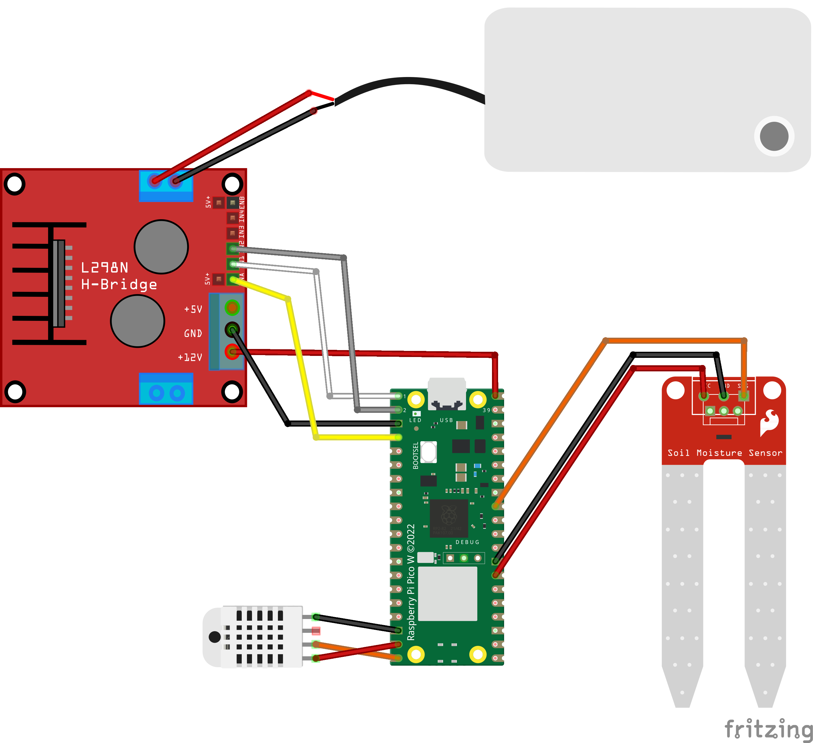

# 🌱 Raspberry Pi Pico W – Plant Monitoring & Watering System

This project runs on a **Raspberry Pi Pico W (2W)** and automates plant monitoring with temperature, humidity, and soil moisture sensors. It uploads data to **ThingSpeak** and waters plants automatically if the soil is too dry.

## ⚡ Features
- Wi-Fi connectivity via Pico W
- Automatic time sync with NTP
- Hourly data upload to ThingSpeak
- Scheduled watering at 08:00 and 20:00 if soil is dry
- Status logging to ThingSpeak
- Free to use and modify

## 🛠️ Hardware Setup
- **Board**: Raspberry Pi Pico W (RP2040)
- **Sensors**:
  - DHT22 (GPIO15)
  - Soil Moisture Sensor → ADC1 (with heater pin on GPIO21)
- **Actuator**:
  - Pump (via L298N motor driver or similar)
  - IN1 = GPIO0  
  - IN2 = GPIO1  
  - ENA (PWM) = GPIO2  

## 🔧 Software Setup
1. Install **MicroPython** on Raspberry Pi Pico W.
2. Upload `main.py` to the Pico.
3. Install dependencies:
   - `dht` (included in MicroPython)
   - `urequests` (for HTTP requests)
   - `ntptime` (for NTP sync)

## 🔌 Wiring Diagram
Here’s the wiring for the Raspberry Pi Pico W setup:
- DHT22 on GPIO15  
- Soil sensor on ADC1 (heater on GPIO21)  
- Pump via motor driver (IN1=GPIO0, IN2=GPIO1, ENA=GPIO2)

<!-- Use HTML to scale the image on GitHub -->
<p align="center">
  
</p>

## 📡 Configuration
Edit `main.py` and set your Wi-Fi and ThingSpeak API key:

```python
SSID = "YOUR_WIFI_NAME"
PASSWORD = "YOUR_WIFI_PASSWORD"
API_KEY = "YOUR_THINGSPEAK_API_KEY"
```

## 📄 Warranty and License
Free to use and modify. 
No warranty provided – use at your own risk.
